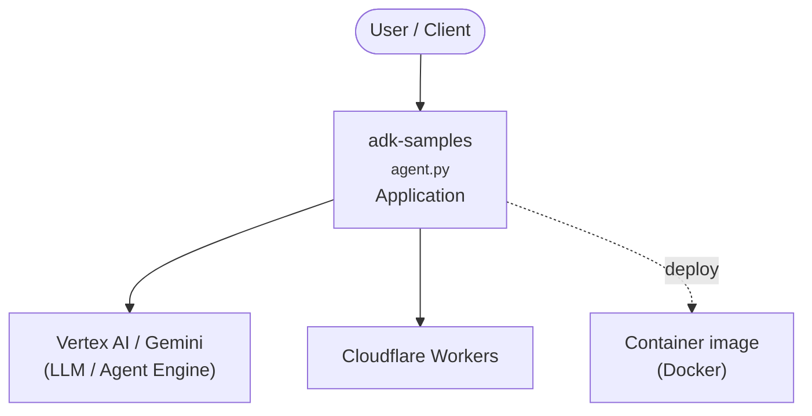

# Security Agent with Google ADK

This repository provides ready-to-use sample security RAG agents (Wiz, and RAG) built on top of the Python [Agent Development Kit (ADK)](https://github.com/google/adk-python). These agents demonstrate a range of use cases and complexities, from fact-checking LLM outputs to retrieval-augmented generation and cloud security integrations.

## Repository Structure

```
adk-samples/
├── python/
│   ├── agents/
│   │   ├── llm-auditor/   # Automated fact-checking agent for LLM outputs
│   │   ├── RAG/           # Retrieval-Augmented Generation agent
│   │   └── wiz/wiz-mcp/   # Model Context Protocol server for Wiz cloud security
│   └── README.md          # Python samples overview
└── README.md              # (This file)
```

Each agent directory contains its own `README.md` with detailed setup and usage instructions.

## Sample Agents

### 1. LLM Auditor
- **Purpose:** Automated fact-checking layer for LLM responses. Identifies factual claims, verifies them using web search and internal knowledge, and can rewrite responses to correct inaccuracies.
- **Location:** `python/agents/llm-auditor/`
- **Features:** Multi-agent workflow, Google Search integration, detailed audit reports.
- **[See detailed instructions](python/agents/llm-auditor/README.md)**

### 2. Documentation Retrieval Agent (RAG)
- **Purpose:** Answers questions about documents uploaded to Vertex AI RAG Engine using Retrieval-Augmented Generation. Provides answers with citations to source documents.
- **Location:** `python/agents/RAG/`
- **Features:** RAG with Vertex AI, citation support, document upload and management scripts.
- **[See detailed instructions](python/agents/RAG/README.md)**

### 3. Wiz MCP Server
- **Purpose:** Model Context Protocol (MCP) server for the Wiz cloud security platform. Integrates with Wiz API and can be run locally or in Docker.
- **Location:** `python/agents/wiz/wiz-mcp/`
- **Features:** API credential management, Docker support, integration with AI assistants.
- **[See detailed instructions](python/agents/wiz/wiz-mcp/README.md)**

## Getting Started

1. **Prerequisites**
   - Python 3.9+ (see agent-specific requirements)
   - [Poetry](https://python-poetry.org/docs/) for dependency management
   - Google Cloud account (for most agents)
   - Agent-specific credentials (see each agent's README)

2. **Clone the Repository**
   ```bash
   git clone https://github.com/google/adk-samples.git
   cd adk-samples/python
   ```

3. **Explore the Agents**
   - Navigate to the `agents/` directory.
   - Each agent has its own subdirectory and `README.md`.

4. **Run an Agent**
   - Follow the instructions in the agent's `README.md` for setup, configuration, and running the agent (usually with Poetry and the ADK CLI or web interface).

## Contributing

We welcome contributions! Please see our [Contributing Guidelines](CONTRIBUTING.md) for details.

## License

This project is licensed under the Apache 2.0 License. See the [LICENSE](LICENSE) file for details.

## Support & Questions

If you have questions or encounter issues, please open an issue on [GitHub](https://github.com/google/adk-samples/issues).

---

*This is not an officially supported Google product. These agents are intended for demonstration purposes only and are not for production use.*

<!-- ARCH-DIAGRAM:START -->

## Architecture

> Auto-generated architecture diagram. See [`docs/context-map.md`](docs/context-map.md) for the full context map (core application, containers/cloud, and database connections).



<!-- ARCH-DIAGRAM:END -->
