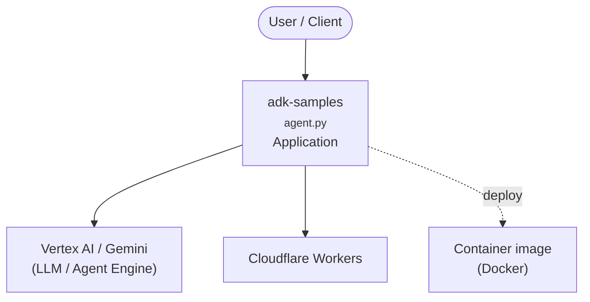

# Context Map — `adk-samples`

> Auto-generated architecture & deployment context map. Summarizes the core application, container/cloud footprint, and database connections. Regenerate after significant structural changes.

**Repo:** `avnit/adk-samples` · **Fork** · Public · Primary language: Python · Default branch: `main` · Files: 134

**Description:** A collection of sample agents built with Agent Development (ADK)

## 1. Core application

Security Agent with Google ADK

- **Entry points:** `python/agents/RAG/rag/agent.py`, `python/agents/auth-provider-demo/auth_provider_demo/agent.py`, `python/agents/llm-auditor/llm_auditor/agent.py`, `python/agents/llm-auditor/llm_auditor/sub_agents/critic/agent.py`, `python/agents/llm-auditor/llm_auditor/sub_agents/device_42/agent.py`, `python/agents/llm-auditor/llm_auditor/sub_agents/reviser/agent.py`
- **Listens on port(s):** 80, 3000, 5000, 8080, 8123, 2283

## 2. Containers & cloud applications

**Containers:**
- `python/agents/llm-auditor/Dockerfile`
- `python/agents/wiz/wiz-mcp/Dockerfile`

**Detected cloud platforms / services:** Vertex AI / Gemini (GCP), Cloudflare Workers

## 3. Database connections

_No database drivers or connection strings detected._

**Environment / config files:** `python/agents/RAG/.env.example`, `python/agents/auth-provider-demo/.env.example`

## 4. Architecture diagram

## 5. Security posture

- No open Dependabot alerts or static-scan findings recorded.

---
_Generated by repo context-mapping pass on 2026-08-13._